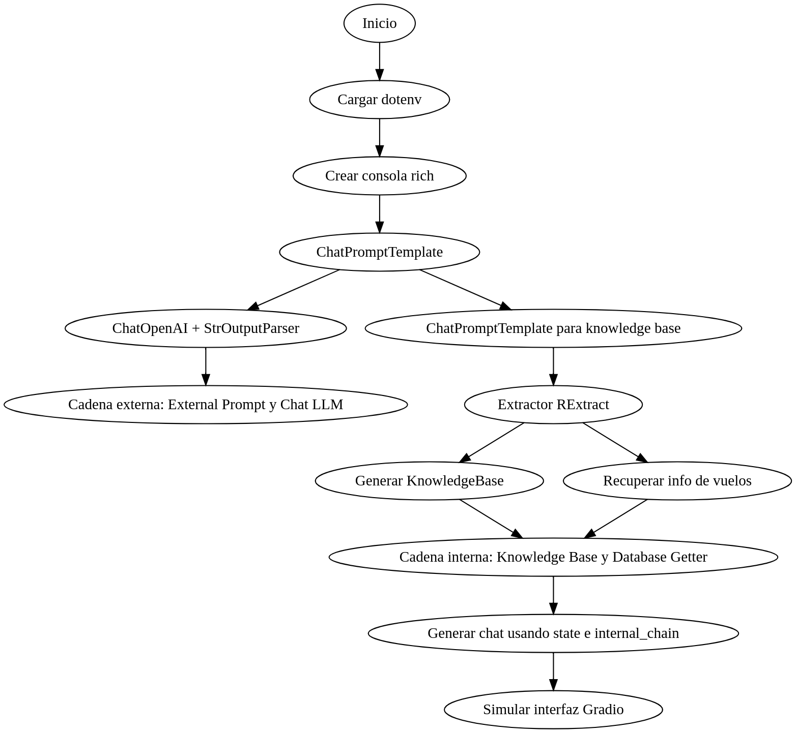

# Ejercicio: Diseñe un chatbot que implemente las siguientes características:

- El bot debería comenzar con una pequeña charla, posiblemente ayudando al usuario con consultas no confidenciales que no requieren acceso a información privada.
- Cuando el usuario comience a preguntar sobre cosas que están protegidas por bases de datos (tanto en la práctica como legalmente), dígale que debe proporcionar la información relevante.
- Cuando la recuperación sea exitosa, el agente podrá hablar sobre la información contenida en la base de datos.

Esto se puede hacer con una variedad de técnicas, incluidas las siguientes:

- Ingeniería de indicaciones y análisis de contexto , donde la indicación general del chat permanece más o menos igual, pero el contexto se manipula para cambiar el comportamiento del agente. Por ejemplo, una recuperación de base de datos fallida se podría cambiar por una inyección de instrucciones en lenguaje natural sobre cómo resolver el problema, como "Information could not be retrieved with keys {...}. Please ask the user for clarification or help them with known information."

- "Paso de indicaciones", donde las indicaciones activas se pasan como variables de estado y pueden ser anuladas por cadenas de monitoreo.

 
- Cadenas de ramificación como RunnableBrancho más soluciones personalizadas que implementan un mecanismo de enrutamiento condicional.
  - En el caso de RunnableBranch, una sintaxis `switch` del estilo:
    ```python
    from langchain.schema.runnable import RunnableBranch
    RunnableBranch(
        ((lambda x: 1 in x), RPrint("Has 1 (didn't check 2): ")),
        ((lambda x: 2 in x), RPrint("Has 2 (not 1 though): ")),
        RPrint("Has neither 1 not 2: ")
    ).invoke([2, 1, 3]);  ## -> Has 1 (didn't check 2): [2, 1, 3]

## Diagrama de flujo

